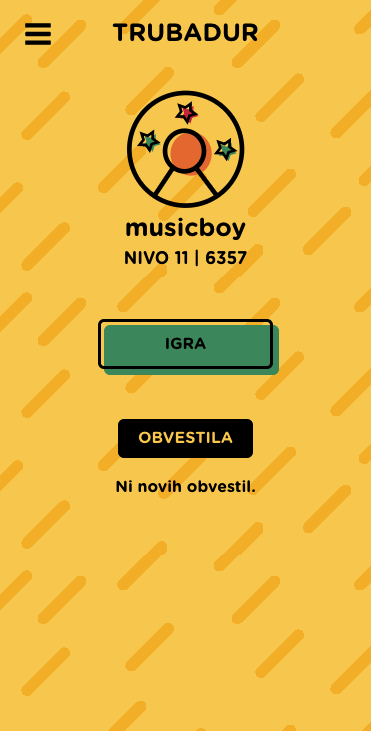
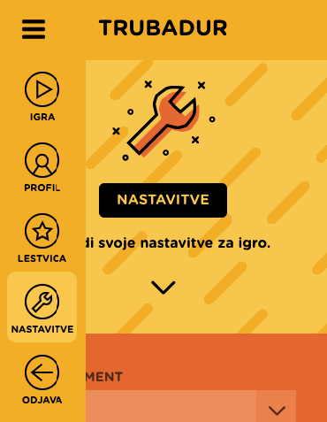
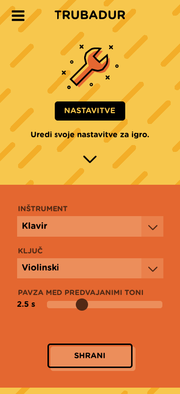
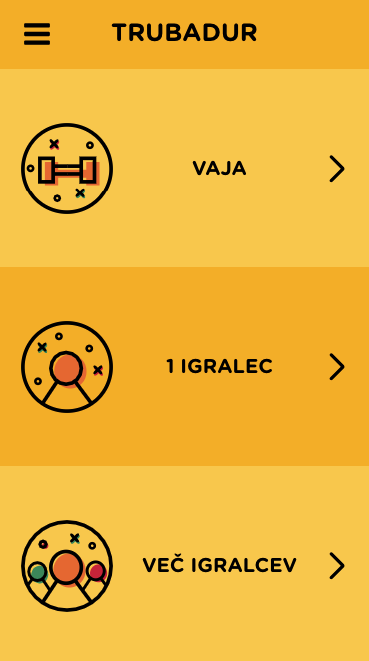
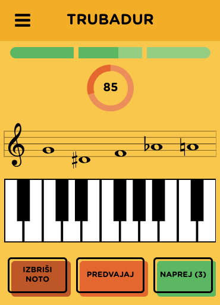
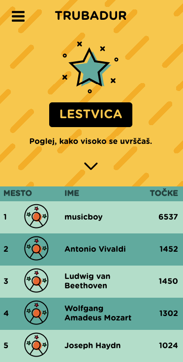
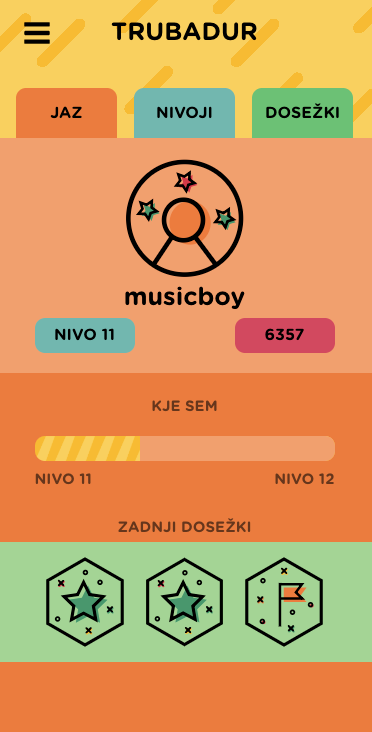
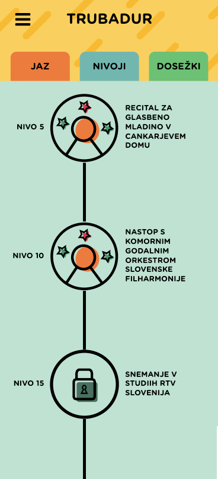
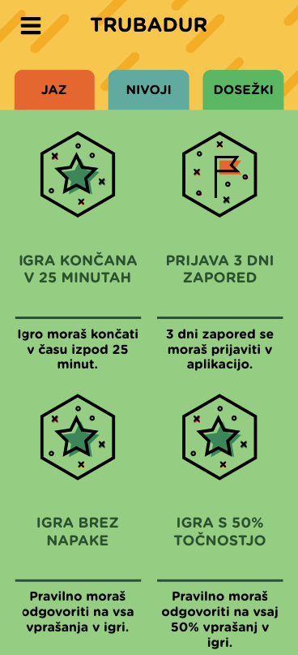

# Trubadur

Gamified music theory e-learning mobile application.

Production version: [https://trubadur.si](https://trubadur.si)

Implemented as part of a master's thesis with title Gamification of music theory learning.

<!--Full text: https://studij.fri.uni-lj.si/File/ZakljucnoDelo?idDvigTeme=21206&ReturnUrl=%2FDashboardStudent (Slovene language)-->

## Showcase screenshots

